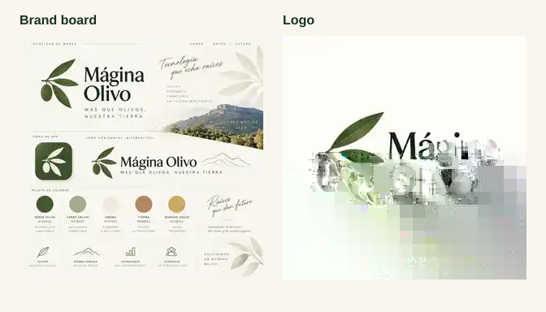
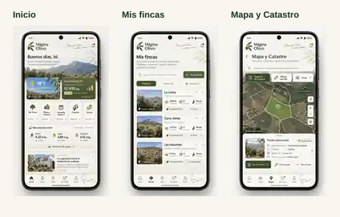
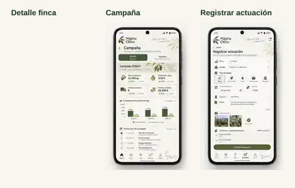
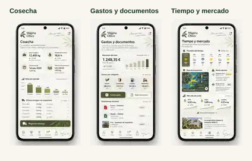
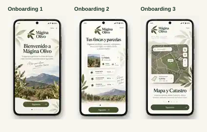
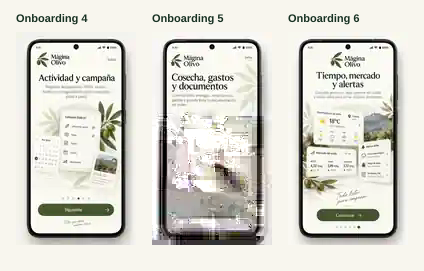

# Mágina Olivo — Referencias visuales oficiales

> **LOCKED** — Estos tableros forman parte de la referencia visual oficial RC1.2. No son moodboards ni ejemplos orientativos: la UI Android debe construirse y validarse contra ellos junto con `../VISUAL_DESIGN_LOCK.md`.

## Marca

### Identidad + logo

## Aplicación

### Inicio · Mis fincas · Mapa y Catastro

### Detalle de finca · Campaña · Registrar actuación

### Cosecha · Gastos y documentos · Tiempo y mercado

## Onboarding — 6 pantallas

### 1/6 Bienvenida · 2/6 Fincas y parcelas · 3/6 Mapa y Catastro

### 4/6 Actividad y campaña · 5/6 Cosecha/gastos/documentos · 6/6 Tiempo/mercado/alertas

## Regla de uso

Al implementar o revisar una pantalla:

1. abrir la referencia correspondiente;
2. comparar composición, márgenes, jerarquía, tipografía, color, radios, sombras, iconografía y fotografía;
3. mantener el mismo lenguaje visual para estados loading/empty/error/offline;
4. adaptar únicamente lo necesario por datos reales, accesibilidad o comportamiento nativo Android;
5. no aceptar una pantalla que derive hacia otro lenguaje visual.

La especificación completa está en [VISUAL_DESIGN_LOCK.md](../VISUAL_DESIGN_LOCK.md).
