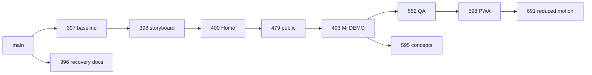

# B1 — inventario Web V3 y portado selectivo

#695/#591, 2026-10-08; main c4617f87. Auditoría Git/PRs, sin merges ni aprobación visual.

| PR | Head auditado | Base declarada | Aporte que revisar |
| --- | --- | --- | --- |
| #396 | 4542a353 | main | Recovery matrix documental independiente |
| #397 | d7a29b80 | main | Baseline Next/Playwright/Pages/Docker y workflow web |
| #398 | 97921ae5 | codex/web-0b-baseline | Storyboard/review inicial |
| #400 | e262596d | codex/web-0c-storyboard | Home V3 estática con referencia aprobada |
| #479 | b12cd8fc | codex/web-v3-public-home | Páginas públicas/copy |
| #493 | f2cd0b3f | codex/web-0d-public-pages | Shell /mi y fixtures DEMO |
| #552 | 691460d1 | codex/web-0e-private-shell | Responsive/a11y/SEO/Docker/QA |
| #598 | 1390a23a | codex/web-0f-qa | PNG192/512 y verificación PWA |
| #691 | 76c1c05d | codex/web-0g-pwa-icons | Duraciones reduced-motion calculadas |
| #595 | 601e0255 | codex/web-0e-private-shell | Rama hermana: board conceptual K01–K12, no aprobación |

## Duplicación / reconciliación

Las ramas apiladas incluyen los cambios anteriores: no cherry-pick/portado del mismo árbol por cada PR. #396 es independiente y su recovery matrix no debe perderse al seleccionar solo el extremo de la cadena. V1/V2 y ramas territoriales antiguas son referencia, no fuentes por defecto.

#595 cambia seis archivos desde #493: workflow web, asset plan, storyboard, imagen PNG12frames, v3-review y smoke tests. Coincide con la cadena QA en `.github/workflows/web-v3.yml` y `web/tests/web-smoke.spec.ts`; documentos de assets y review comparten historia pero requieren revisión semántica.

Comprobación ejecutada: `git merge-tree --write-tree origin/codex/web-reduced-motion-qa origin/codex/web-0c-creative-direction` → exit0, árbol `bd6885691a1fa4b540f4e70b6090c73422486408`. Sin conflictos de texto, sin checkout, branch update ni merge commit. No acredita QA del árbol combinado, imágenes aprobadas ni autorización de integrar.

Conservar conjuntamente tests PWA192/512, noindex/SEO/keyboard/viewport, reduced-motion y assertions K01–K12 pendientes. Conservar checks Pages del storyboard nuevo y de PNG reales; no reemplazar un workflow con una versión antigua que pierda uno de esos checks.

## Portado futuro #591

Solo tras V3-A y cierre del gate WEB-0: nueva rama desde main actualizado, copiar árbol final aprobado web/**, recuperar documentación #396 si corresponde y portar exclusivamente workflow/config web necesaria. El diff actual de cadena respecto main incluye `.github/workflows/web-v3.yml`; no portar otros workflows Android por herencia de la rama. Revisar root config de forma explícita si cambia, sin copiar historia completa.

Excluir node_modules, .next, out, resultados de tests, credenciales, backend productivo y cualquier app/** heredado del punto antiguo de main. Conservar fixtures DEMO/noindex y assets con procedencia. Repetir lint/typecheck/build/Pages/Playwright/Docker desde main; antes de ese gate, solo QA independiente.

Bloqueo visual concreto: propietario debe aprobar continuidad/personaje/teléfono/luz, hero desktop/móvil y transición campo→móvil de K01–K12. #595 sigue rotulando Pendiente y no tiene review que cierre V3-A. El bloqueo no es un error de CI. No producir secuencia final ni motor como cumplimiento definitivo antes de esa aprobación.

NEXT=B2–B5 QA del extremo 76c1c05d; árbol combinado aún sin QA y sin aprobación.
